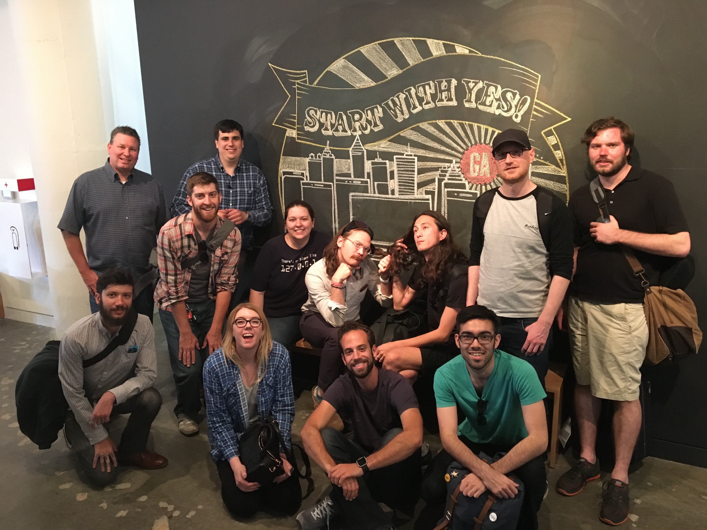

# WDI Instructor Summit Notes

Had a great time in Atlanta networking and making friends from other campuses.

Bringing home tons of inspiring stuff, some that could be implemented sooner rather than later, other things which should be on the radar and can refer to for inspiration as we continue to iterate on the curriculum here in DC.

Day 01 - Monday

On Monday representatives from each instructional team presented an overview of how they present the curriculum in their market. It was a pleasant surprise to see the curriculum moving towards more common goals but still each campus has their own approach and their own personality.

Most of the well-established and successful campuses teach Javascript first, and are mostly following the relative same sequence as the outline from Baseline.

People are coming to a lot of the same conclusions in terms of curriculum.

### Metro Share-Out
[METRO Share-Out Notes](metro-share-out.md)

Hightlights include:
- Half-day Wednesdays
- Removing Auth from several projects
- RepoTagger
- GArnet / GAlaxy student-tracker
- "Teach the class, not the curriculum"
- "The power of language"

Day 02 - Tuesday

Day 02 and 03 gave instructors a chance to share best practices.

## Santa Monica
Phil Lamplugh on Teaching and Classroom Management
- relating concepts to the real world
- writing questions on the wall
- whys poignant guide to ruby
- Metaphors!

What is your go-to variable for an array?
Rafa from NY suggested a closet

    
How do you explain function parameters?
woodchipper, placeholders

    
How do you describe HTTP?
Game of Battleship

    
Node.js? The DOM? variable scope...?

    Go to the summit next year!

## Seattle, Austin
Brian Hague and Sean Shannon spoke about ES6 aka ES2015. There was no resolution but it seemed that most people think it's a good idea to introduce as a special topic in support of something like React.js. Special tooling may be necessary due to lack of cross-browser support. React is going to have some transpiling anyway so why not do ES6? Suggested build tools:  Babel, webpack, Gulp

## Remote
Adi Hanash, Matt Huntington and Gordon ____ gave a great presentation on the remote curriculum. They started with red flags and had a failed attempt at a live demo using Cloud9. Despite the technical challenges, we were all impressed that this is going to be cool.

## New York
Jason Seminara spoke about React.js in WDI. Again, there was no resolution, but we think it would be similar to the ES6/2015 question. Most people think it's a good idea to introduce as a special topic.

## Global
Jay Nappy spoke about using Git/GitHub in the classroom. Specifically, copyright issues.
- Teaching trick: Jay made a Gist presentation with 3 prompts: "React to this statement"
- GA is speaking with GitHub about an Enterprise account. We'll see what happens!

## Atlanta
Dr. Mike Hopper spoke about GAlaxy - another website for instructor/student interaction built in the MEAN stack.

## Global
Jeanny spoke to us about Instructor collaborations with Instructional Design.
- What does collaboration look like?
- It seems like they don't have tooling for this but so we need to build our own.
- Highlighted DC's processes as a way to start collaborating without waiting for global

## New York / Global
Jessica Skeete - WDI Vision for the Future
- Other campuses ARE failing students as late as week 6! Global average is 9% failure rate
- We did a SWOT analysis, which was also awesome.

Day 03 - Wednesday

Wednesday was short and sweet.

## New York
Andrew Madden, the Lead Instructor in NYC used to carry a notecard with him as a reminder of how to set up a great lesson:

* Context
* Specific
* How
* Objectives

He also introduced two useful ways to avoid a codealong:
1. Catch up
2. Screencast

## Boston

Boston is doing a bunch of cool things. One things that stuck out is their philosophy about language. They are firm believes in the power of language and think that is extremely important and frames the entire course. Here are some of our own rewrites of the [language we use](./language.md)

Boston also puts the MIT license and a copyright notice in all their public repos on GitHub. What do you think of [this license](./license.md)

## Global
Jess had a follow-up session in response to her session the previous day.
- "We are not trying to impose one curriculum on everybody."
- There is a need to have a set of modular resources that local instructional teams can influence and selectively poach as needed

## LA, Seattle
Meredith Byers and Chelsea Byers co-led a wrap up activity, "Rose, Thorn & Bud"

## Action Items

And at the end we quickly developed a tool that came to be known as [The Benn Diagram](images/wdi-summit-ben-diagram.pdf)

What does this look like for our market?

